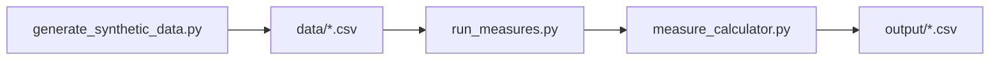

# HEDIS Quality Measures Lab (Educational Proxies, Synthetic)

**Author:** Faiz Elahi · **Type:** EDUCATIONAL PORTFOLIO LAB · **SYNTHETIC DATA ONLY**

---

## Educational disclaimer / synthetic data

This lab uses **synthetic members, enrollment, and claims** to teach **HEDIS-style measure logic**. It is **not NCQA-certified**, not payer production code, and not real member data.

Use honest language: *“I implemented educational proxies for HbA1c and breast cancer screening rates on synthetic claims.”*

---

## Problem statement (detailed)

Health plan analytics and quality teams report **HEDIS** (Healthcare Effectiveness Data and Information Set) measures to regulators and purchasers. Analysts must:

- Define **denominators** (eligible members in a measurement year with continuous enrollment rules simplified here).
- Map **numerators** from claims using procedure/LOINC codes in the measurement window.
- Slice rates by **facility**, **age band**, and control totals for audit.

This lab implements **simplified educational proxies**—HbA1c screening (CDC-style) and breast cancer screening—for 2,500 synthetic members with planted screening codes so students see non-trivial numerators without accessing real payer warehouses.

---

## Why this tool

| Spreadsheet pivot | This lab pipeline |
|-------------------|-------------------|
| Opaque eligibility | Explicit denominator CSVs per measure |
| Manual code lists | Centralized screening code sets in Python |
| No audit trail | `output/control_totals.csv` and summary tables |

Pairs with **`pharmacy-claims-adherence-lab`** (medication adherence) and **`dbt-healthcare-marts-lab`** (tested marts).

---

## Architecture



See [`docs/architecture.md`](docs/architecture.md).

---

## Dataset dictionary (tables / columns)

| File | Grain | Key columns | Notes |
|------|-------|-------------|-------|
| `members.csv` | Member | `member_id`, `sex`, `dob`, `age_2024`, `age_band`, `primary_facility`, `has_diabetes_flag` | 2,500 synthetic members |
| `enrollment.csv` | Enrollment span | `member_id`, `enroll_start`, `enroll_end` | Active-in-year logic in code |
| `claims.csv` | Claim line | `claim_id`, `member_id`, `service_date`, `procedure_code`, `claim_type`, `facility_id` | Includes screening codes |
| `diabetes_denominator.csv` | Member-year | `member_id`, `measurement_year` | HbA1c proxy denominator |
| `breast_cancer_denominator.csv` | Member-year | `member_id`, `measurement_year` | Mammography proxy denominator |
| `output/hba1c_summary.csv` | Measure | `measure`, `denominator`, `numerator`, `rate` | Year 2024 summary |
| `output/bc_summary.csv` | Measure | Same shape | Breast cancer proxy |
| `output/hba1c_by_facility.csv` | Slice | Facility-level rates | From merged numerators |
| `output/hba1c_by_age.csv` | Slice | Age-band rates | Teaching stratification |
| `output/control_totals.csv` | QA | Row counts | Reconciliation helper |

---

## Prerequisites

- Python 3.10+
- `pandas`, `numpy` (see `requirements.txt`)

---

## Step-by-step: how to run

### Windows PowerShell

```powershell
cd hedis-quality-measures-lab
python -m venv .venv
.\.venv\Scripts\Activate.ps1
pip install -r requirements.txt
python scripts/generate_synthetic_data.py
python src/run_measures.py
python scripts/generate_charts.py
```

### Optional bash

```bash
cd hedis-quality-measures-lab
python3 -m venv .venv && source .venv/bin/activate
pip install -r requirements.txt
python scripts/generate_synthetic_data.py
python src/run_measures.py
python scripts/generate_charts.py
```

---

## File-by-file walkthrough

| Path | Role |
|------|------|
| `scripts/generate_synthetic_data.py` | Members, enrollment, claims, denominator tables |
| `src/measure_calculator.py` | HbA1c and breast cancer proxy logic, stratifications |
| `src/run_measures.py` | Writes all `output/*.csv` |
| `src/paths.py` | Data and output directory paths |
| `scripts/generate_charts.py` | Rate visualization under `docs/images/` |

---

## Expected outputs and how to interpret them

- **`hba1c_summary.csv`** — Denominator count, numerator (members with ≥1 screening code), and rate for measurement year **2024**.
- **`bc_summary.csv`** — Mammography proxy for eligible female denominators.
- **Facility and age slices** — Compare variation; synthetic planting may cluster at certain facilities.
- **`control_totals.csv`** — Use in class to verify joins did not drop rows silently.

Screening codes in code include **`83036`, `4548-4`, `83037`** (HbA1c proxy) and **`77067`, `77063`, `G0202`** (mammography proxy)—simplified lists only.

---

## Results interpretation

- Rates are **proportions of denominator members with any qualifying claim**—not risk-adjusted quality scores.
- **Continuous enrollment** and **single-plan** rules are abbreviated; real HEDIS specs span hundreds of pages.
- A lower rate in one facility may reflect **generator randomness**, not actionable quality failure.

---

## Glossary (8+ terms)

1. **HEDIS** — Standardized performance measures used by US health plans (NCQA).
2. **Denominator** — Eligible population for a measure in a measurement year.
3. **Numerator** — Members meeting the clinical action (screening, control, etc.).
4. **Measurement year** — Calendar window for attribution (here: 2024).
5. **CPT** — Procedure coding system on claims (`procedure_code`).
6. **LOINC** — Lab code system; used in HbA1c proxy set.
7. **NCQA** — Organization that maintains HEDIS specifications.
8. **Educational proxy** — Simplified logic for learning—not audit-ready submission.
9. **Stratification** — Reporting rates by facility or age band.

---

## Common mistakes (5+)

1. Calling outputs **“certified HEDIS rates”** on a resume or in interviews.
2. Counting **multiple screening claims** as multiple numerator events (here: member-level any-hit).
3. Ignoring **enrollment gaps** that real specs would exclude.
4. Mixing **institutional and professional** claim types without measure-specific rules.
5. Using **wrong measurement year** filters on `service_date`.
6. Forgetting **sex/age eligibility** for breast cancer denominators.

---

## Exercises (5+)

1. Add a **continuous enrollment** flag in SQL/pandas and recompute rates.
2. Implement a third proxy measure (e.g., **blood pressure control**) with a new denominator file.
3. Document **code list versioning** in a markdown table tied to NCQA public summaries (conceptual).
4. Compare **`hba1c_by_facility`** to member diabetes flags—discuss confounding.
5. Export rates to a JSON dashboard spec for **`apache-superset-dashboard-as-code-lab`**.
6. Write unit tests for denominator row counts vs `members.csv` filters.

---

## Limitations / simulation vs production

- Not NCQA-certified; code lists and value sets are truncated.
- No lab results ingestion—claims-only proxies.
- Synthetic members—not representative of any plan’s population.
- Educational code—**no regulatory submission use**.

---

## Related labs

- [`pharmacy-claims-adherence-lab`](../pharmacy-claims-adherence-lab/) — PDC/MPR on pharmacy claims.
- [`dbt-healthcare-marts-lab`](../dbt-healthcare-marts-lab/) — Tested quality marts.
- [`snowflake-healthcare-finance-elt-lab`](../snowflake-healthcare-finance-elt-lab/) — Claims ELT patterns.

---

**Author:** Faiz Elahi · Educational portfolio use.
